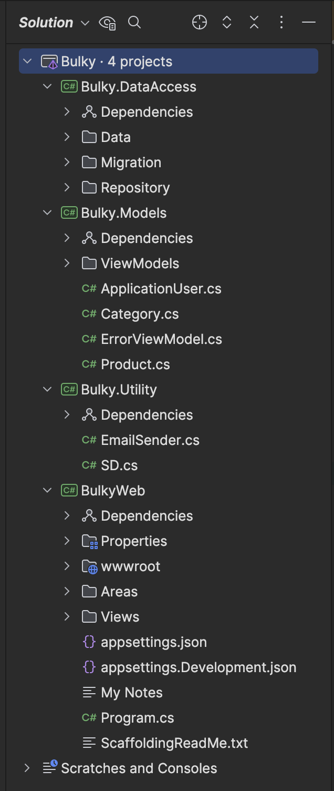

# Bulky - MVC Uygulaması

Bu proje, **Bulky** adlı bir kitap yönetim sistemi olup, **ASP.NET Core 8** kullanılarak geliştirilmiş bir MVC uygulamasıdır. Uygulama, kitapları yönetmek için basit bir arayüz sağlar. İki tür kullanıcı mevcuttur: **Admin** ve **Customer**. Admin kullanıcıları kitap ekleyebilir, düzenleyebilir ve silebilirken, Customer kullanıcıları kitapları görüntüleyebilir.

https://github.com/user-attachments/assets/79b75f9b-94bd-4a18-bc96-0e44a2a0f3d2


## Kullanılan Teknolojiler ve Mimariler

- **ASP.NET Core Identity**: Kimlik doğrulama ve kullanıcı yönetimi için kullanılmıştır.
- **MySQL**: Veritabanı olarak MySQL kullanılmıştır.
- **Entity Framework Core**: Veritabanı işlemleri için kullanılmıştır.
- **Scaffold**: CRUD işlemleri için otomatik olarak oluşturulmuş kodlar.
- **N-Tier Architecture**: Uygulama mimarisi, katmanlı bir yapıdadır (N-Tier). Katmanlar aşağıdaki gibi ayrılmıştır:
    - **Bulky.DataAccess**: Veritabanı işlemleri, `AppDbContext` ve migration dosyaları burada yer alır.
    - **Bulky.Models**: Uygulama boyunca kullanılan veri modelleri bu katmanda bulunur.
    - **Bulky.Utilities**: Yardımcı sınıflar ve genel amaçlı araçlar. Örneğin, roller için oluşturulmuş `SD` classı burada yer alır.
    - **BulkyWeb**: Web uygulamasının ana katmanı, kullanıcı arayüzü, controller'lar ve view'lar burada yer alır.

> **Not**: Bu yapıyı görsel olarak açıklamak için dizin yapılarını gösteren ekran görüntülerini ekleyebilirsiniz.

## Proje Yapısı


### Solution Yapısı



## Özellikler

- **Admin Paneli**: Admin kullanıcıları kitap ekleyebilir, düzenleyebilir ve silebilir.
- **Kitap Listeleme**: Tüm kullanıcılar kitapları görüntüleyebilir.
- **Kimlik Doğrulama**: **ASP.NET Core Identity** kullanılarak kullanıcı giriş ve kayıt işlemleri.
- **Veritabanı**: **Entity Framework Core** ve **MySQL** ile veritabanı işlemleri gerçekleştirilir.
- **Areas**: Admin ve Customer için ayrılmış alanlar (areas) kullanılmıştır.
- **Scaffold İşlemleri**: CRUD işlemleri için scaffold işlemleri kullanılmıştır.

## Kurulum

1. **Projeyi klonlayın**:
    ```bash
    git clone https://github.com/MehmetCopurCE/Bulky.git
    ```

2. **Proje dizinine gidin**:
    ```bash
    cd bulky
    ```

3. **Gerekli bağımlılıkları yükleyin**:
    ```bash
    dotnet restore
    ```

4. **Veritabanını yapılandırın**:
    - `appsettings.json` dosyasındaki veritabanı bağlantı dizesini (`ConnectionStrings`) kendi MySQL veritabanı bilgilerinizle güncelleyin.
    - Migration işlemlerini gerçekleştirin:
    ```bash
    dotnet ef database update
    ```

5. **Uygulamayı çalıştırın**:
    ```bash
    dotnet run
    ```

## Kullanıcı Rolleri

- **Admin**:
    - Kitap ekleyebilir, düzenleyebilir ve silebilir.
    - Diğer kullanıcıları yönetebilir.
- **Customer**:
    - Kitapları görüntüleyebilir.
    - Admin yetkilerine sahip değildir.

## Kullanılan NuGet Paketleri


## Veritabanı

Bu projede **MySQL** veritabanı kullanılmaktadır. Veritabanı işlemleri için **Entity Framework Core** tercih edilmiştir. Aşağıdaki adımları takip ederek veritabanı yapılandırmasını gerçekleştirebilirsiniz:

1. **Veritabanı Bağlantı Dizesini Güncelleyin**:
   - `appsettings.json` dosyasındaki `ConnectionStrings` bölümüne MySQL veritabanı bağlantı dizesini ekleyin.

   ```json
   {
     "ConnectionStrings": {
       "DefaultConnection": "server=localhost;database=bulkydb;user=root;password=yourpassword"
     }
   }
2. **Migration Oluşturun ve Veritabanını Güncelleyin**:
    - Migration işlemleri için aşağıdaki komutları çalıştırın:
   ```csharp
    dotnet ef migrations add InitialCreate
    dotnet ef database update
    ```


## Kaynaklar

Bu projeyi geliştirirken aşağıdaki eğitim kursunu takip ettim:

- **Kurs Adı**: [Introduction to ASP.NET Core MVC (.NET 8)](https://www.youtube.com/watch?v=AopeJjkcRvU)
  - Bu kurs, ASP.NET Core MVC kullanarak temel ve ileri düzey web uygulamaları geliştirmeyi öğretiyor. Proje yapısından, kimlik doğrulama işlemlerine kadar birçok konuyu kapsıyor.


## İletişim ve Geri Bildirim

Proje hakkında fikirlerinizi veya önerilerinizi paylaşmaktan çekinmeyin. Bana aşağıdaki kanallardan ulaşabilirsiniz:


<a href="https://www.linkedin.com/in/mehmet-copur/"></a> <a href="mailto:mhmtcpr120@gmail.com?"></a> <a href="https://medium.com/@mhmtcpr120/nette-dependency-injection-transient-scoped-ve-singleton-ya%C5%9Fam-d%C3%B6ng%C3%BCleri-aa9aa4f38193"></a> 


Her türlü geri bildiriminiz benim için değerlidir ve projeyi daha iyi hale getirmek için yardımcı olacaktır.
