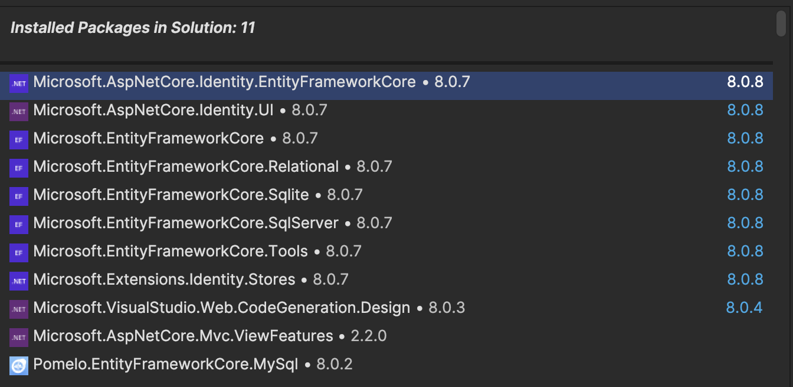

# Bulky - MVC Uygulaması

Bu proje, **Bulky** adlı bir kitap yönetim sistemi olup, **ASP.NET Core 8** kullanılarak geliştirilmiş bir MVC uygulamasıdır. Uygulama, kitapları yönetmek için basit bir arayüz sağlar. İki tür kullanıcı mevcuttur: **Admin** ve **Customer**. Admin kullanıcıları kitap ekleyebilir, düzenleyebilir ve silebilirken, Customer kullanıcıları kitapları görüntüleyebilir.

## Kullanılan Teknolojiler ve Mimariler

- **ASP.NET Core Identity**: Kimlik doğrulama ve kullanıcı yönetimi için kullanılmıştır.
- **MySQL**: Veritabanı olarak MySQL kullanılmıştır.
- **Entity Framework Core**: Veritabanı işlemleri için kullanılmıştır.
- **Scaffold**: CRUD işlemleri için otomatik olarak oluşturulmuş kodlar.
- **N-Tier Architecture**: Uygulama mimarisi, katmanlı bir yapıdadır (N-Tier). Katmanlar aşağıdaki gibi ayrılmıştır:
    - **Bulky.DataAccess**: Veritabanı işlemleri, `AppDbContext` ve migration dosyaları burada yer alır.
    - **Bulky.Models**: Uygulama boyunca kullanılan veri modelleri bu katmanda bulunur.
    - **Bulky.Utilities**: Yardımcı sınıflar ve genel amaçlı araçlar. Örneğin, roller için oluşturulmuş `SD` classı burada yer alır.
    - **BulkyWeb**: Web uygulamasının ana katmanı, kullanıcı arayüzü, controller'lar ve view'lar burada yer alır.

> **Not**: Bu yapıyı görsel olarak açıklamak için dizin yapılarını gösteren ekran görüntülerini ekleyebilirsiniz.

## Proje Yapısı


### Solution Yapısı


## Özellikler

- **Admin Paneli**: Admin kullanıcıları kitap ekleyebilir, düzenleyebilir ve silebilir.
- **Kitap Listeleme**: Tüm kullanıcılar kitapları görüntüleyebilir.
- **Kimlik Doğrulama**: **ASP.NET Core Identity** kullanılarak kullanıcı giriş ve kayıt işlemleri.
- **Veritabanı**: **Entity Framework Core** ve **MySQL** ile veritabanı işlemleri gerçekleştirilir.
- **Areas**: Admin ve Customer için ayrılmış alanlar (areas) kullanılmıştır.
- **Scaffold İşlemleri**: CRUD işlemleri için scaffold işlemleri kullanılmıştır.

## Kurulum

1. **Projeyi klonlayın**:
    ```bash
    git clone https://github.com/MehmetCopurCE/Bulky.git
    ```

2. **Proje dizinine gidin**:
    ```bash
    cd bulky
    ```

3. **Gerekli bağımlılıkları yükleyin**:
    ```bash
    dotnet restore
    ```

4. **Veritabanını yapılandırın**:
    - `appsettings.json` dosyasındaki veritabanı bağlantı dizesini (`ConnectionStrings`) kendi MySQL veritabanı bilgilerinizle güncelleyin.
    - Migration işlemlerini gerçekleştirin:
    ```bash
    dotnet ef database update
    ```

5. **Uygulamayı çalıştırın**:
    ```bash
    dotnet run
    ```

## Kullanıcı Rolleri

- **Admin**:
    - Kitap ekleyebilir, düzenleyebilir ve silebilir.
    - Diğer kullanıcıları yönetebilir.
- **Customer**:
    - Kitapları görüntüleyebilir.
    - Admin yetkilerine sahip değildir.

## Kullanılan NuGet Paketleri




## Uygulama Ekran Görüntüleri

> Buraya uygulamadan bazı ekran görüntüleri ekleyebilirsin.

## Katkıda Bulunma

Katkıda bulunmak isterseniz, lütfen bir **pull request** gönderin. Herhangi bir sorunla karşılaşırsanız, lütfen bir **issue** oluşturun.

## Lisans

Bu proje [MIT](https://opensource.org/licenses/MIT) lisansı altında lisanslanmıştır.
